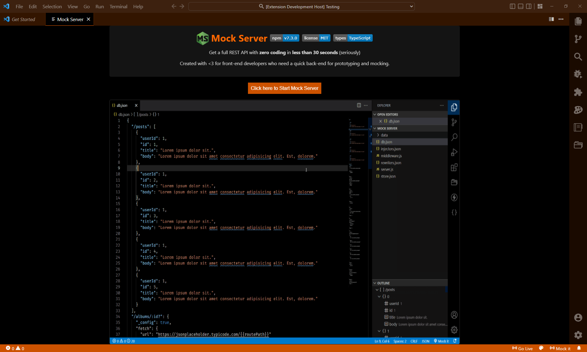

# Mock Server

- Click [here](https://r35007.github.io/Mock-Server/) for mock server documentation.
- Click [here](https://github.com/R35007/Mock-Server/blob/main/CHANGELOG.md) to see more changes reg the `@r35007/mock-server` package

## v14.1.0

- Restart the mock server on changes in environment data file.

## v14.0.0

- Support for JSON with comments.
- Added - `Mock It` command in context menu. Helps to run the current file data in mock server.
- Added - `Switch Environment` command in context menu.
- Build size reduced using webpack.
  
## v13.0.3

- Context menu show and hide issue fixed.
  
## v13.0.2

- Build size reduced
- Context menu grouped by publisher name.

## v13.0.1

- Build size reduced

## v13.0.0

- Removed - `Set as Server Root Folder` is removed from context menu. 
- Added - Mock Server submenus in the editor context.
- Added  - `mock-server.settings.contextMenu` - Helps to show or hide commands in context menu,
- Updated - Right click on any `.json` file and select `Start Server` from context to start the mock server with the current file as an `env` file.  
  
## v12.2.0

- Updated `@r35007/mock-server@12.2.0`.
- Added - Right click on any file and select `Paste Mock Server Config` to get the mock server current config used by vscode config.

## v12.1.0

- Updated `@r35007/mock-server@12.1.0`.
- samples update.
- Added - Right click on mock server config `.js` or `.json` file and select `Set as Mock Server Config` to set the mock server config in vscode config.

## v12.0.0

- Updated `@r35007/mock-server@12.0.0`.
- samples update.

## v11.2.2

- Updated `@r35007/mock-server@11.2.0`.
- samples update.

## v11.2.1

- samples update.

## v11.2.0

- added - File icon on `Switch Environment` pick list. Helps to open selected db files.

## v11.1.0

- Updated `@r35007/mock-server@11.1.0`.

## v11.0.1

- Fixed - Not restarting on changes on the fetch paths

## v11.0.0

- Updated `@r35007/mock-server@11.0.0`.
- renamed `mock-server.settings.paths.middleware` to `mock-server.settings.paths.middlewares`
- renamed `_harEntryCallback` to `harEntryCallback`
- renamed `_harDbCallback` to `harDbCallback`
- renamed `_kibanaHitsCallback` to `kibanaHitsCallback`
- renamed `_kibanaDbCallback` to `kibanaDbCallback`
- renamed `_globals` to `globals`

## v10.3.4

- Fixed - Transform to MockServer Db not working.

## v10.3.3

- Fixed - Transforming to MockServer Db not showing a valid error message.
- Improved - Environment pick list.

## v10.3.2

- Fixed - Server not starting with `none` environment.

## v10.3.1

- Fixed - Env not picking injectors and middlewares by default.

## v10.3.0

- Updated `@r35007/mock-server@10.3.3`.
- Fixed - Not Transforming if current text file is larger than 4mb.

## v10.2.0

- Updated `@r35007/mock-server@10.2.0`.
- renamed - `mock-server.settings.paths.envDir` to `mock-server.settings.paths.environment`
- renamed - `mock-server.settings.paths.staticDir` to `mock-server.settings.paths.static`
- renamed - `mock-server.settings.paths.snapshotDir` to `mock-server.settings.paths.snapshots`

## v10.0.0

- Updated `@r35007/mock-server@10.1.0`.
- Removed - `mock-server.settings.fullReload`. By default It always resets and restarts the server on changes.

## v9.3.1

- fixed - `Switch Environment` not working issue fixed.
- added - progress bar for `Transform to Mock Server Db`, `Get Db Snapshot`, `Generate Sample Mock Files`.

## v9.3.0

- added - Create a custom database test environment using `env.config.json`.
  For Example: `env/env.config.json`
  ```json
  // These names will be listed in the environment pick list
  {
    "Your Environment Name": {
      "db": "./testDb.json",
      "injectors": "./testInjectors.json",
      "middlewares": "./testMiddlewares.js",
      "description": "Your description here" // This description will be shown in the switch environment pick list
    },
    "Your New  Environment Name": {
      "db": ["./testDb2.json", "./testDb2.json"] // Can also provide multiple paths
    }
  }
  ```
  > Note: All the paths given in the `env.config.json` will be relative to the path given in `mock-server.settings.paths.environment`. File or Folder name with `injectors` and `middlewares` will not list in the pick list.

## v9.2.2

- updated - Switch Environment pick list shows relative File path of the `env` directory.
- removed - `Mock Server Config Logs` and `Mock Server Path Log` in output panel. Now both will show at `Mock Server Log`

## v9.2.1

- updated - Switch Environment pick list shows relative File path of the `root` directory.

## v9.2.0

- updated - `@r35007/mock-server@9.2.0`.
- updated - Switch Environment pick list shows File path.

## v9.1.0

- updated - `@r35007/mock-server@9.1.0`.

## v9.0.1

- updated - `@r35007/mock-server@9.0.1`.

## v9.0.0

- updated - `@r35007/mock-server@9.0.0`.
- method in `env` folder file is not getting the `mockServer` instance - `Fixed`
- Code optimized.

## v8.1.1

- updated - `@r35007/mock-server@8.0.1`.

## v8.1.0

- updated - `@r35007/mock-server@8.0.0`.
- added - `mock-server.settings.homePage` - If false, The Mock Server Home Page will not be served. Default: true.

## v8.0.1

- code optimized.

## v8.0.0

- removed MockServer: Reset - `mock-server.reset` command.
- removed MockServer: Reset and Restart - `mock-server.resetAndRestart` command.
- removed Start Server with New Port - `mock-server.startWithNewPort` command.
- added `mock-server.settings.openHomePageInsideVSCode` - By default it open the homepage inside VS Code. If false it open in a default browser.
- Home Page improved.
  
- Home Page not refreshing on start or stop of the server - `Fixed`

## v7.3.1

- `mock-server.settings.dbMode` not working issue - `Fixed`

## v7.3.0

- Updated `@r35007/mock-server@7.3.0`
- added `multi` mode in `mock-server.settings.dbMode`
- removed `mock-server.settings.useLocalIp`- instead Leave it empty to `mock-server.settings.host` to pick the local ip address.

## v7.2.1

- Updated `@r35007/mock-server@7.2.1`
- rewriters not working - `Fixed`

## v7.2.0

- Updated `@r35007/mock-server@7.2.0`
- added `mock-server.settings.useLocalIp` - uses Local Ip address instead of `mock-server.settings.host`
- added `mock-server.settings.fullReload` - If true it always resets and restarts the server on changes.
- added `mock-server.settings.ignoreFiles` - Add list of files and folder path to ignore changes.
- renamed `mock-server.settings.customWatchPaths` to `mock-server.settings.watchFiles`
- Set `mock-server.settings.port` to 0 (zero) to pick a dynamic available port.

## v7.1.0

- Updated `@r35007/mock-server@7.1.0`
- added `cookieParser` in default middlewares.
- file watcher not stopping on server stop - `Fixed`

## v7.0.1

- Updated `@r35007/mock-server@7.0.1`
- middleware callbacks are not working on `mock-server.transformToMockServerDB` command - `Fixed`
- config not updated when using `mockServer` inside `middleware.js` exports - `Fixed`

## v7.0.0

- Updated `@r35007/mock-server@7.0.0`
- added `mock-server.startWithNewPort` command - Helps to set a new port and start the server
- If already a server is running at the same port it prompts the user to give a new port and start the server

## v6.1.0

- Updated `@r35007/mock-server@6.1.0`
- added `mock-server.settings.dbMode` - Helps to set a direct value of a route to `mock` or `fetch`
- renamed `mock-server.settings.allowDuplicates` to `mock-server.settings.iterateDuplicateRoutes`
- updated `mock-server.settings.watchForChanges` - Set to true to restart server on changes watched by `mock-server.settings.customWatchPaths`
- added `mock-server.settings.customWatchPaths` - Provide your custom paths to watch for changes
- removed `mock-server.settings.environment` - maintained by localStorage
- added - On Start or Restart of the server the info popup comes with the link to open up the browser with the homepage
- Now we pass the instance and config of the mockserver to the methods that are exported as a db, injectors etc...
  For Example :
  `db.js`

  ```js
  module.exports = (mockServer, env) => {
    const db = {
      post: {
        userId: 1,
        id: 1,
        title: "New Post",
      },
    };

    return db;
  };
  ```

## v6.0.7

- Updated `@r35007/mock-server@6.0.5`
- Now we can give `.js` file in env folder

## v6.0.6

- Updated `@r35007/mock-server@6.0.4`

## v6.0.5

- Updated `@r35007/mock-server@6.0.3`

## v6.0.4

- Updated `@r35007mock-server@6.0.2`
- Now we can export a function in db.js which will be called on start and restart of the mock server.

## v6.0.3

- Performance improvement
- `mock-server.settings.watchForChanges` - add custom paths to watch for file changes and restart server

## v6.0.2

- Readme update

## v6.0.1

- Updated `@r35007/mock-server@6.0.1`
- `entryCallback` is now renamed to `_harEntryCallback`
- `finalCallback` is now renamed to `_harDbCallback`
- Added `Set as Server Root folder` command. Helps to set current selected folder as a mock server root folder. Also available in context menu
- Added `Reset Server` command. Helps to clear mock server cache a, gracefully stops server and reset server data.
- Added `Reset and Restart Server` command. Helps to reset and restart the server with new server instance.
- Added `Mock Server Paths Log` and `Mock Server Config Log` output log.

## v5.0.1

- Updated `@r35007/mock-server@5.0.1`

## v5.0.0

- Updated `@r35007/mock-server@5.0.0`

## v4.5.2

- Updated `@r35007/mock-server@4.5.1`
-

## v4.5.1

- Updated `@r35007/mock-server@4.5.0`
- Now can give .js file to the db, injectors, rewriters, store path

## v4.5.0

- Added `Set Port` Command which is also available in editor context.

## v4.4.1

- On clicking of Stop Server in editor context before starting the server makes the statusbar to show wrong info and become unable to start server - `Fixed`
- Now Stop Sever in editor context will show only on `.json` and `.har` file

## v4.4.0

- removed adding injectors config on transforming to Mock Server Db.
- Synced with `@r35007/mock-server` package.

## v4.3.1

- `mock-server.settings.paths.snapshotsDir` - Add a snapshot dir to get your d snapshots
- Dynamically run any json file to start the server by right clicking and select `Start Server` in editor context.
- Synced with `@r35007/mock-server` package.

## v4.2.0

- Stopping Server takes too long Bug fixed.
- `Generate Mock Files` Command added.
- Added commands in editor context
- Restart Server bug fixed.

## v3.0.3

- License Update

## v3.0.2

- ReadMe update

## v3.0.0

- Implemented mock server `Home Page` inside vs code.
- Added more settings
- Updated `@r35007/mock-server@3.0.9`

## v2.1.4

- `mock-server.settings.store` is renamed to `mock-server.settings.paths.storePath`
- updated `@r35007/mock-server@2.4.2`

## v2.1.3

- Bug Fix
- updated `@r35007/mock-server@2.4.1`
- changes default mockPath from `https://jsonplaceholder.typicode.com/db` to `http://jsonplaceholder.typicode.com/db`

## v2.1.2

- updated `@r35007/mock-server@2.3.1`
- Now can directly access server Mock data.
  Try to give the following code in `settings.json`

```json
{
  "mock-server.settings.paths": {
    "mockPath": "https://jsonplaceholder.typicode.com/db"
  }
}
```

## v2.0.6

- updated `@r35007/mock-server@2.1.1`

## v2.0.5

- `mock-server.resetServer` command bug fix.

## v2.0.4

- updated `@r35007/mock-server@2.1.0`

## v2.0.1,v2.0.2,v2.0.3

- Bug Fix
- updated `@r35007/mock-server@2.0.10`

## v2.0.0

- Bug Fix
- Added File watcher. Automatically restarts the server for file changes.
- updated `@r35007/mock-server@2.0.7`

## v1.0.0

- Initial release
